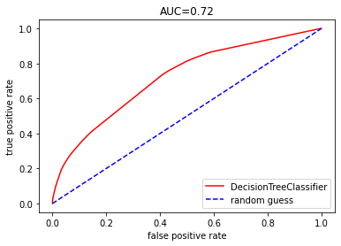
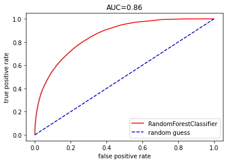

```python
import pandas as pd
```


```python
import gzip
import shutil
```


```python
import warnings
warnings.filterwarnings('ignore')
%matplotlib inline
```


```python
with gzip.open('train.gz', 'rb') as f_in: #gz파일 풀어서 csv로 오픈
    with open('train.csv', 'wb') as f_out:
      shutil.copyfileobj(f_in, f_out)
```


```python
train_df = pd.read_csv('train.csv', nrows=100000, encoding='utf-8')
#encoding='utf-8' 안해주면 한글 깨짐
```


```python
train_df
```


<div>
<style scoped>
    .dataframe tbody tr th:only-of-type {
        vertical-align: middle;
    }

    .dataframe tbody tr th {
        vertical-align: top;
    }

    .dataframe thead th {
        text-align: right;
    }
</style>
<table border="1" class="dataframe">
  <thead>
    <tr style="text-align: right;">
      <th></th>
      <th>id</th>
      <th>click</th>
      <th>hour</th>
      <th>C1</th>
      <th>banner_pos</th>
      <th>site_id</th>
      <th>site_domain</th>
      <th>site_category</th>
      <th>app_id</th>
      <th>app_domain</th>
      <th>...</th>
      <th>device_type</th>
      <th>device_conn_type</th>
      <th>C14</th>
      <th>C15</th>
      <th>C16</th>
      <th>C17</th>
      <th>C18</th>
      <th>C19</th>
      <th>C20</th>
      <th>C21</th>
    </tr>
  </thead>
  <tbody>
    <tr>
      <th>0</th>
      <td>1.000009e+18</td>
      <td>0</td>
      <td>14102100</td>
      <td>1005</td>
      <td>0</td>
      <td>1fbe01fe</td>
      <td>f3845767</td>
      <td>28905ebd</td>
      <td>ecad2386</td>
      <td>7801e8d9</td>
      <td>...</td>
      <td>1</td>
      <td>2</td>
      <td>15706</td>
      <td>320</td>
      <td>50</td>
      <td>1722</td>
      <td>0</td>
      <td>35</td>
      <td>-1</td>
      <td>79</td>
    </tr>
    <tr>
      <th>1</th>
      <td>1.000017e+19</td>
      <td>0</td>
      <td>14102100</td>
      <td>1005</td>
      <td>0</td>
      <td>1fbe01fe</td>
      <td>f3845767</td>
      <td>28905ebd</td>
      <td>ecad2386</td>
      <td>7801e8d9</td>
      <td>...</td>
      <td>1</td>
      <td>0</td>
      <td>15704</td>
      <td>320</td>
      <td>50</td>
      <td>1722</td>
      <td>0</td>
      <td>35</td>
      <td>100084</td>
      <td>79</td>
    </tr>
    <tr>
      <th>2</th>
      <td>1.000037e+19</td>
      <td>0</td>
      <td>14102100</td>
      <td>1005</td>
      <td>0</td>
      <td>1fbe01fe</td>
      <td>f3845767</td>
      <td>28905ebd</td>
      <td>ecad2386</td>
      <td>7801e8d9</td>
      <td>...</td>
      <td>1</td>
      <td>0</td>
      <td>15704</td>
      <td>320</td>
      <td>50</td>
      <td>1722</td>
      <td>0</td>
      <td>35</td>
      <td>100084</td>
      <td>79</td>
    </tr>
    <tr>
      <th>3</th>
      <td>1.000064e+19</td>
      <td>0</td>
      <td>14102100</td>
      <td>1005</td>
      <td>0</td>
      <td>1fbe01fe</td>
      <td>f3845767</td>
      <td>28905ebd</td>
      <td>ecad2386</td>
      <td>7801e8d9</td>
      <td>...</td>
      <td>1</td>
      <td>0</td>
      <td>15706</td>
      <td>320</td>
      <td>50</td>
      <td>1722</td>
      <td>0</td>
      <td>35</td>
      <td>100084</td>
      <td>79</td>
    </tr>
    <tr>
      <th>4</th>
      <td>1.000068e+19</td>
      <td>0</td>
      <td>14102100</td>
      <td>1005</td>
      <td>1</td>
      <td>fe8cc448</td>
      <td>9166c161</td>
      <td>0569f928</td>
      <td>ecad2386</td>
      <td>7801e8d9</td>
      <td>...</td>
      <td>1</td>
      <td>0</td>
      <td>18993</td>
      <td>320</td>
      <td>50</td>
      <td>2161</td>
      <td>0</td>
      <td>35</td>
      <td>-1</td>
      <td>157</td>
    </tr>
    <tr>
      <th>...</th>
      <td>...</td>
      <td>...</td>
      <td>...</td>
      <td>...</td>
      <td>...</td>
      <td>...</td>
      <td>...</td>
      <td>...</td>
      <td>...</td>
      <td>...</td>
      <td>...</td>
      <td>...</td>
      <td>...</td>
      <td>...</td>
      <td>...</td>
      <td>...</td>
      <td>...</td>
      <td>...</td>
      <td>...</td>
      <td>...</td>
      <td>...</td>
    </tr>
    <tr>
      <th>99995</th>
      <td>7.336716e+18</td>
      <td>0</td>
      <td>14102100</td>
      <td>1005</td>
      <td>0</td>
      <td>85f751fd</td>
      <td>c4e18dd6</td>
      <td>50e219e0</td>
      <td>5e3f096f</td>
      <td>2347f47a</td>
      <td>...</td>
      <td>1</td>
      <td>0</td>
      <td>21611</td>
      <td>320</td>
      <td>50</td>
      <td>2480</td>
      <td>3</td>
      <td>297</td>
      <td>100111</td>
      <td>61</td>
    </tr>
    <tr>
      <th>99996</th>
      <td>7.337102e+18</td>
      <td>0</td>
      <td>14102100</td>
      <td>1005</td>
      <td>0</td>
      <td>1fbe01fe</td>
      <td>f3845767</td>
      <td>28905ebd</td>
      <td>ecad2386</td>
      <td>7801e8d9</td>
      <td>...</td>
      <td>1</td>
      <td>0</td>
      <td>15702</td>
      <td>320</td>
      <td>50</td>
      <td>1722</td>
      <td>0</td>
      <td>35</td>
      <td>-1</td>
      <td>79</td>
    </tr>
    <tr>
      <th>99997</th>
      <td>7.337105e+18</td>
      <td>1</td>
      <td>14102100</td>
      <td>1005</td>
      <td>0</td>
      <td>1fbe01fe</td>
      <td>f3845767</td>
      <td>28905ebd</td>
      <td>ecad2386</td>
      <td>7801e8d9</td>
      <td>...</td>
      <td>1</td>
      <td>0</td>
      <td>15702</td>
      <td>320</td>
      <td>50</td>
      <td>1722</td>
      <td>0</td>
      <td>35</td>
      <td>-1</td>
      <td>79</td>
    </tr>
    <tr>
      <th>99998</th>
      <td>7.337331e+17</td>
      <td>0</td>
      <td>14102100</td>
      <td>1005</td>
      <td>0</td>
      <td>1fbe01fe</td>
      <td>f3845767</td>
      <td>28905ebd</td>
      <td>ecad2386</td>
      <td>7801e8d9</td>
      <td>...</td>
      <td>1</td>
      <td>0</td>
      <td>15708</td>
      <td>320</td>
      <td>50</td>
      <td>1722</td>
      <td>0</td>
      <td>35</td>
      <td>-1</td>
      <td>79</td>
    </tr>
    <tr>
      <th>99999</th>
      <td>7.337345e+18</td>
      <td>0</td>
      <td>14102100</td>
      <td>1002</td>
      <td>0</td>
      <td>cc1b7a47</td>
      <td>7256c623</td>
      <td>50e219e0</td>
      <td>ecad2386</td>
      <td>7801e8d9</td>
      <td>...</td>
      <td>0</td>
      <td>0</td>
      <td>21665</td>
      <td>320</td>
      <td>50</td>
      <td>2493</td>
      <td>3</td>
      <td>35</td>
      <td>-1</td>
      <td>117</td>
    </tr>
  </tbody>
</table>
<p>100000 rows × 24 columns</p>
</div>


```python
unused_columns, label_column = ['id','hour','device_id','device_ip'], 'click'
```


```python
train_df = train_df.drop(unused_columns, axis=1)
```


```python
X_dict_train = list(train_df.drop(label_column, axis=1).T.to_dict().values())
#df->dictionary형태로 바꾸어 그 안의 values만 추출
```


```python
X_dict_train[0]
```


    {'C1': 1005,
     'banner_pos': 0,
     'site_id': '1fbe01fe',
     'site_domain': 'f3845767',
     'site_category': '28905ebd',
     'app_id': 'ecad2386',
     'app_domain': '7801e8d9',
     'app_category': '07d7df22',
     'device_model': '44956a24',
     'device_type': 1,
     'device_conn_type': 2,
     'C14': 15706,
     'C15': 320,
     'C16': 50,
     'C17': 1722,
     'C18': 0,
     'C19': 35,
     'C20': -1,
     'C21': 79}


```python
y_train = train_df[label_column] #y대상벡터데이터
```


```python
test_df = pd.read_csv('train.csv', header=0, skiprows=(1, 100000),nrows=100000)
```


```python
test_df=test_df.drop(unused_columns,axis=1)
```


```python
X_dict_test = list(test_df.drop(label_column, axis=1).T.to_dict().values())
```


```python
y_test = test_df[label_column]
```

여기까지, 데이터 준비 완료

## scikit-learn의 트리 기반의 모델들의 중요한 특징은 입력변수로 사용하는 특징 모두 수치로 사용함
범주형 데이터 -> 원 핫 인코딩 벡터 변환하기-딕셔너리로 변환


```python
from sklearn.feature_extraction import DictVectorizer
```


```python
vectorizer = DictVectorizer(sparse=True) 
#메모리 벡터행렬 생성시 희소행렬이 만들어지기 때문에 메모리에 문제가 감
```


```python
X_train = vectorizer.fit_transform(X_dict_train)
```


```python
X_train.shape #19차원에서 4952차원으로 늘어남 (범주형데이터를 인코딩하면 변함)
```


    (100000, 4952)


```python
X_train.toarray()[:5] #희소행렬이 아닌 정상형 데이터로 변환하기
```


    array([[ 1005., 15706.,   320., ...,     0.,     0.,     0.],
           [ 1005., 15704.,   320., ...,     0.,     0.,     0.],
           [ 1005., 15704.,   320., ...,     0.,     0.,     0.],
           [ 1005., 15706.,   320., ...,     0.,     0.,     0.],
           [ 1005., 18993.,   320., ...,     0.,     0.,     0.]])


```python
X_test = vectorizer.fit_transform(X_dict_test)
#테스트용도 변환작업
```

## 그리드 서치를 이용하여 의사결정 트리 모델 학습하기


```python
from sklearn.tree import DecisionTreeClassifier
```


```python
parameters = {'max_depth':[3,10,None]}
```


```python
decision_tree = DecisionTreeClassifier(criterion='gini', min_samples_split=30)
#의사결정트리 분류모듈 decision_tree에 저장한다.
```

### GridSearchCV 클래스는 validation_curve 함수와 달리 모형 래퍼(Wrapper) 성격의 클래스이다. 
### 클래스 객체에 fit 메서드를 호출하면 grid search를 사용하여 자동으로 복수개의 내부 모형을 생성하고 이를 모두 실행시켜서 최적 파라미터를 찾아준다. 생성된 복수개와 내부 모형과 실행 결과는 다음 속성에 저장된다.


```python
from sklearn.model_selection import GridSearchCV
```


```python
#1. GridSearchCV 이용하여 객체 생성
grid_search = GridSearchCV(decision_tree, parameters, n_jobs=-1, cv=3,scoring='roc_auc')
#roc_auc 곡선화 면적
```


```python
grid_search
```


    GridSearchCV(cv=3, estimator=DecisionTreeClassifier(min_samples_split=30),
                 n_jobs=-1, param_grid={'max_depth': [3, 10, None]},
                 scoring='roc_auc')


## 그리드 서치를 이용해 적합화시키기


```python
#.fit 메서드는  최적의 매개변수를 찾는 일뿐만 아니라, 교차 검증 성능이 가장 좋은
#매개 변수로 전체 훈련 데이터 세트에 대해 새로운 모델을 자동으로 만든다.
grid_search.fit(X_train, y_train)
```


    GridSearchCV(cv=3, estimator=DecisionTreeClassifier(min_samples_split=30),
                 n_jobs=-1, param_grid={'max_depth': [3, 10, None]},
                 scoring='roc_auc')


```python
grid_search.best_params_ #가장 적합한 파라미터
```


    {'max_depth': 10}


```python
decision_tree_best= grid_search.best_estimator_
```

## 의사결정 트리모델 파일 출력 -export graphviz사용


```python
from sklearn.tree import export_graphviz
```


```python
export_graphviz(decision_tree_best, out_file='ctr_decision_tree.dot',
               feature_names=vectorizer.feature_names_, class_names=["0","1"], rounded=True, filled=True, impurity=True)
```


```python
import pydot
```


```python
graph = pydot.graph_from_dot_file("ctr_decision_tree.dot")[0]
```


```python
#graph_png=graph.create_png() 이미지저장
```


```python
#from IPython.core.display import Image
```


```python
graph.write_png('ctr_decision_tree.png')
```

## 의사결정 트리 모델의 성능 측정 : 정확도, 혼동행렬, ROC의 AUC


```python
import numpy as np
```


```python
y_pred = decision_tree_best.predict(X_test) 
#그리드 서치로 만든 best model로 test데이커 갖고 예측하기
```


```python
y_pred
```


    array([0, 0, 0, ..., 0, 0, 0], dtype=int64)


```python
np.unique(y_pred, return_counts=True)
#0=클릭 안할것이다 96537건, 1=클릭할것이다 3463건
```


    (array([0, 1], dtype=int64), array([96545,  3455], dtype=int64))


```python
from sklearn.metrics import accuracy_score
```


```python
accuracy_score(y_test, y_pred)
#y_test : 실제 관측값 / y_pred : 모델에서 만든 예측값
```


    0.83249


```python
from sklearn.metrics import confusion_matrix
```


```python
confusion_matrix(y_test, y_pred)
```


    array([[81152,  1358],
           [15393,  2097]], dtype=int64)


## roc 사용


```python
from sklearn.metrics import roc_auc_score, roc_curve
```


```python
%matplotlib inline
from matplotlib import pyplot as plt
```


```python
y_pred_proba = decision_tree_best.predict_proba(X_test)[:,1]
#predict_proba:확률기반, 클릭할 확률, 안할확률 
```


```python
y_pred_proba
```


    array([0.20767654, 0.13114754, 0.24324324, ..., 0.11586207, 0.06559647,
           0.06559647])


```python
fpr, tpr, _ = roc_curve(y_test, y_pred_proba)
#fpr, tpr과 관련된 벡터를 얻어 시각화 가능
```


```python
auc = roc_auc_score(y_test, y_pred_proba)
```


```python
plt.plot(fpr, tpr, '-r', label='DecisionTreeClassifier') #red직선, 범례출력
plt.plot([0,1],[0,1], 'b--', label = 'random guess')#blue 점선
plt.xlabel('false positive rate')
plt.ylabel('true positive rate')
plt.title ('AUC={0:.2f}' .format(auc)) 
plt.legend(loc = 'lower right'); #범례 우측하단 출력
```





## 디시젼 트리의 가장 큰 문제는 고분산성을 갖는 것임
즉, 훈련데이터에 대한 적합이 심함..
### 앙상블 학습하기 : 성능이 좋지 않은 알고리즘들을 결합시켜 종합한 결과더 좋게 만드는 것(대표적인 케이스가 배깅)

##랜덤포레스트 사용


```python
from sklearn.ensemble import RandomForestClassifier
```


```python
random_forest=RandomForestClassifier(n_estimators=100, criterion='gini',
                                    min_samples_split=20, n_jobs=-1
#n_estimators=생성할 tree의 개수, min_samples_split=노드를 분할하기 위한 최소한의 데이터수
```


```python
grid_search=GridSearchCV(random_forest, parameters, n_jobs=-1, cv=3, scoring='roc_auc')
```


```python
grid_search.fit(X_train, y_train)
```


    GridSearchCV(cv=3,
                 estimator=RandomForestClassifier(min_samples_split=20, n_jobs=-1),
                 n_jobs=-1, param_grid={'max_depth': [3, 10, None]},
                 scoring='roc_auc')


```python
from sklearn.metrics import confusion_matrix
```


```python
grid_search.best_params_
```


    {'max_depth': None}


```python
random_forest_best = grid_search.best_estimator_
```


```python
y_pred = random_forest_best.predict(X_test)
```


```python
y_pred
```


    array([0, 0, 0, ..., 0, 0, 0], dtype=int64)


```python
accuracy_score(y_test, y_pred) 
```


    0.8549


```python
confusion_matrix(y_test, y_pred)
```


    array([[81269,  1241],
           [13269,  4221]], dtype=int64)


```python
y_pred_proba = random_forest_best.predict_proba(X_test)[:,1]
```


```python
y_pred_proba
```


    array([0.20165866, 0.13365058, 0.30600962, ..., 0.12200564, 0.16629205,
           0.04950002])


```python
fpr, tpr, _ = roc_curve(y_test, y_pred_proba)
```


```python
auc = roc_auc_score(y_test, y_pred_proba)
```


```python
plt.plot(fpr, tpr, '-r', label='RandomForestClassifier') #red직선, 범례출력
plt.plot([0,1],[0,1], 'b--', label = 'random guess')#blue 점선
plt.xlabel('false positive rate')
plt.ylabel('true positive rate')
plt.title ('AUC={0:.2f}' .format(auc)) 
plt.legend(loc = 'lower right'); #범례 우측하단 출력
```





```python

```
