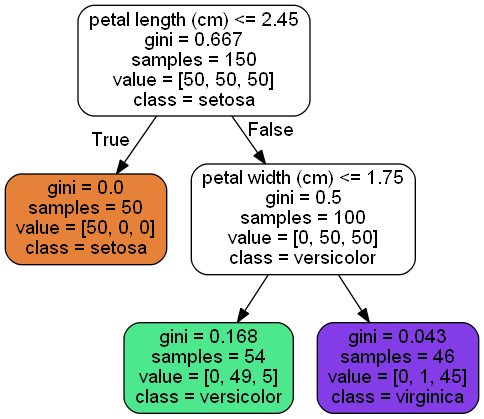

```python
from sklearn.datasets import load_iris
```


```python
iris = load_iris()
```


```python
iris.keys()
```


    dict_keys(['data', 'target', 'frame', 'target_names', 'DESCR', 'feature_names', 'filename'])


```python
iris.data[:5] #feature_names키를 이용해 1~4번째 열의 정보값을 알수 있음
```


    array([[5.1, 3.5, 1.4, 0.2],
           [4.9, 3. , 1.4, 0.2],
           [4.7, 3.2, 1.3, 0.2],
           [4.6, 3.1, 1.5, 0.2],
           [5. , 3.6, 1.4, 0.2]])


```python
iris.feature_names
```


    ['sepal length (cm)',
     'sepal width (cm)',
     'petal length (cm)',
     'petal width (cm)']


## 1. 특징행렬만들기


```python
X = iris.data[:, 2:] #모든행, 3,4번째 열
```


```python
X
```


    array([[1.4, 0.2],
           [1.4, 0.2],
           [1.3, 0.2],
           [1.5, 0.2],
           [1.4, 0.2],
           [1.7, 0.4],
           [1.4, 0.3],
           [1.5, 0.2],
           [1.4, 0.2],
           [1.5, 0.1],
           [1.5, 0.2],
           [1.6, 0.2],
           [1.4, 0.1],
           [1.1, 0.1],
           [1.2, 0.2],
           [1.5, 0.4],
           [1.3, 0.4],
           [1.4, 0.3],
           [1.7, 0.3],
           [1.5, 0.3],
           [1.7, 0.2],
           [1.5, 0.4],
           [1. , 0.2],
           [1.7, 0.5],
           [1.9, 0.2],
           [1.6, 0.2],
           [1.6, 0.4],
           [1.5, 0.2],
           [1.4, 0.2],
           [1.6, 0.2],
           [1.6, 0.2],
           [1.5, 0.4],
           [1.5, 0.1],
           [1.4, 0.2],
           [1.5, 0.2],
           [1.2, 0.2],
           [1.3, 0.2],
           [1.4, 0.1],
           [1.3, 0.2],
           [1.5, 0.2],
           [1.3, 0.3],
           [1.3, 0.3],
           [1.3, 0.2],
           [1.6, 0.6],
           [1.9, 0.4],
           [1.4, 0.3],
           [1.6, 0.2],
           [1.4, 0.2],
           [1.5, 0.2],
           [1.4, 0.2],
           [4.7, 1.4],
           [4.5, 1.5],
           [4.9, 1.5],
           [4. , 1.3],
           [4.6, 1.5],
           [4.5, 1.3],
           [4.7, 1.6],
           [3.3, 1. ],
           [4.6, 1.3],
           [3.9, 1.4],
           [3.5, 1. ],
           [4.2, 1.5],
           [4. , 1. ],
           [4.7, 1.4],
           [3.6, 1.3],
           [4.4, 1.4],
           [4.5, 1.5],
           [4.1, 1. ],
           [4.5, 1.5],
           [3.9, 1.1],
           [4.8, 1.8],
           [4. , 1.3],
           [4.9, 1.5],
           [4.7, 1.2],
           [4.3, 1.3],
           [4.4, 1.4],
           [4.8, 1.4],
           [5. , 1.7],
           [4.5, 1.5],
           [3.5, 1. ],
           [3.8, 1.1],
           [3.7, 1. ],
           [3.9, 1.2],
           [5.1, 1.6],
           [4.5, 1.5],
           [4.5, 1.6],
           [4.7, 1.5],
           [4.4, 1.3],
           [4.1, 1.3],
           [4. , 1.3],
           [4.4, 1.2],
           [4.6, 1.4],
           [4. , 1.2],
           [3.3, 1. ],
           [4.2, 1.3],
           [4.2, 1.2],
           [4.2, 1.3],
           [4.3, 1.3],
           [3. , 1.1],
           [4.1, 1.3],
           [6. , 2.5],
           [5.1, 1.9],
           [5.9, 2.1],
           [5.6, 1.8],
           [5.8, 2.2],
           [6.6, 2.1],
           [4.5, 1.7],
           [6.3, 1.8],
           [5.8, 1.8],
           [6.1, 2.5],
           [5.1, 2. ],
           [5.3, 1.9],
           [5.5, 2.1],
           [5. , 2. ],
           [5.1, 2.4],
           [5.3, 2.3],
           [5.5, 1.8],
           [6.7, 2.2],
           [6.9, 2.3],
           [5. , 1.5],
           [5.7, 2.3],
           [4.9, 2. ],
           [6.7, 2. ],
           [4.9, 1.8],
           [5.7, 2.1],
           [6. , 1.8],
           [4.8, 1.8],
           [4.9, 1.8],
           [5.6, 2.1],
           [5.8, 1.6],
           [6.1, 1.9],
           [6.4, 2. ],
           [5.6, 2.2],
           [5.1, 1.5],
           [5.6, 1.4],
           [6.1, 2.3],
           [5.6, 2.4],
           [5.5, 1.8],
           [4.8, 1.8],
           [5.4, 2.1],
           [5.6, 2.4],
           [5.1, 2.3],
           [5.1, 1.9],
           [5.9, 2.3],
           [5.7, 2.5],
           [5.2, 2.3],
           [5. , 1.9],
           [5.2, 2. ],
           [5.4, 2.3],
           [5.1, 1.8]])


```python
iris.target[:5]
```


    array([0, 0, 0, 0, 0])


```python
import numpy as np
```

numpy.unique= 입력된 배열에서 중복되지 않는 고유한 요소들의 배열을 리턴함.
이 함수는 고유한 값들의 배열의 튜플 또는 연관된 인덱스들을 리턴함


```python
np.unique(iris.target, return_counts=True) #return_counts=True 빈도수 확인하기
```


    (array([0, 1, 2]), array([50, 50, 50], dtype=int64))


```python
iris.target_names
```


    array(['setosa', 'versicolor', 'virginica'], dtype='<U10')


```python
y=iris.target
```

이로써, 특징행렬과 대상 벡터 준비 완료

## Decision TreeClassifier 모델 객체 생성 및 적합화


```python
from sklearn.tree import DecisionTreeClassifier
```


```python
tree = DecisionTreeClassifier(max_depth=2) #depth : 0~2 이진트리 형태
```


```python
tree.fit(X, y) # 적합화 시키기
```


    DecisionTreeClassifier(max_depth=2)


## 의사결정 트리 출력하기


```python
from sklearn.tree import export_graphviz
```


```python
export_graphviz(tree, out_file="iris.dot", feature_names=iris.feature_names[2:],
               class_names=iris.target_names, rounded=True, filled=True, impurity=True)
```


```python
import pydot
```


```python
graph = pydot.graph_from_dot_file("iris.dot")[0]
```


```python
iris_png = graph.create_png()
```


```python
from IPython.core.display import Image
```


```python
Image(iris_png) 
```





트리 내용
petal width<0.8: 세토사
petal width>0.8 : 특징 1.75기준으로 작으면 왼쪽으로 versicolor
특징중요도가 매우 중요함
petal_length 정보를 안쓰고 구성함.

의사결정 트리의 특징 중요도
1. 의사결정 트리를 기반으로 하는 모델은 특징의 상대적 중요도를 측정하기 쉬운 장점을 지님.
2. 의사결정 트리는 일부 특징은 배제함.


```python

```
